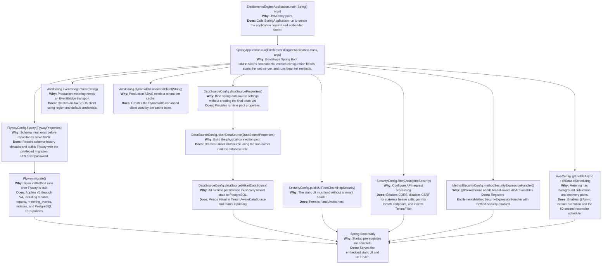
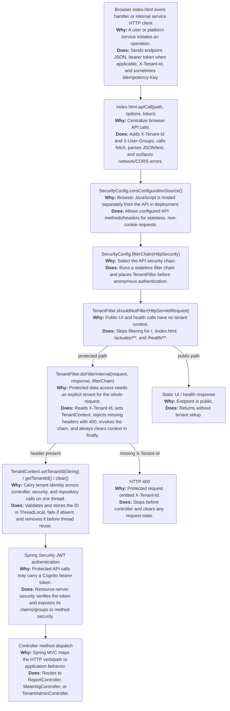
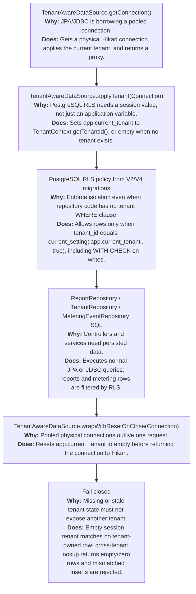
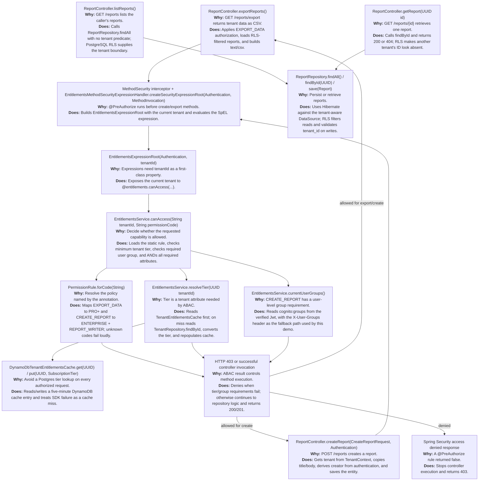
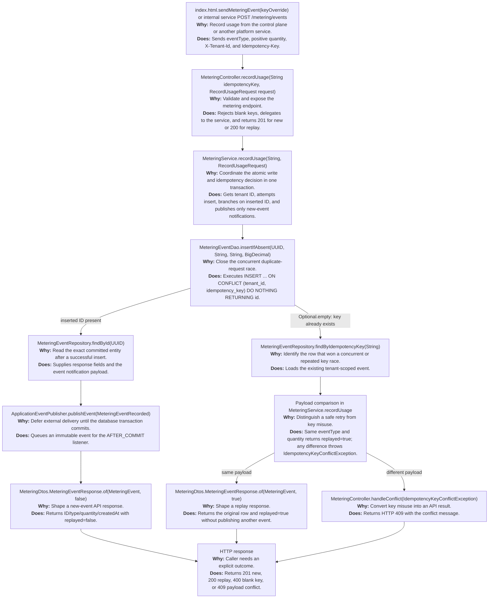
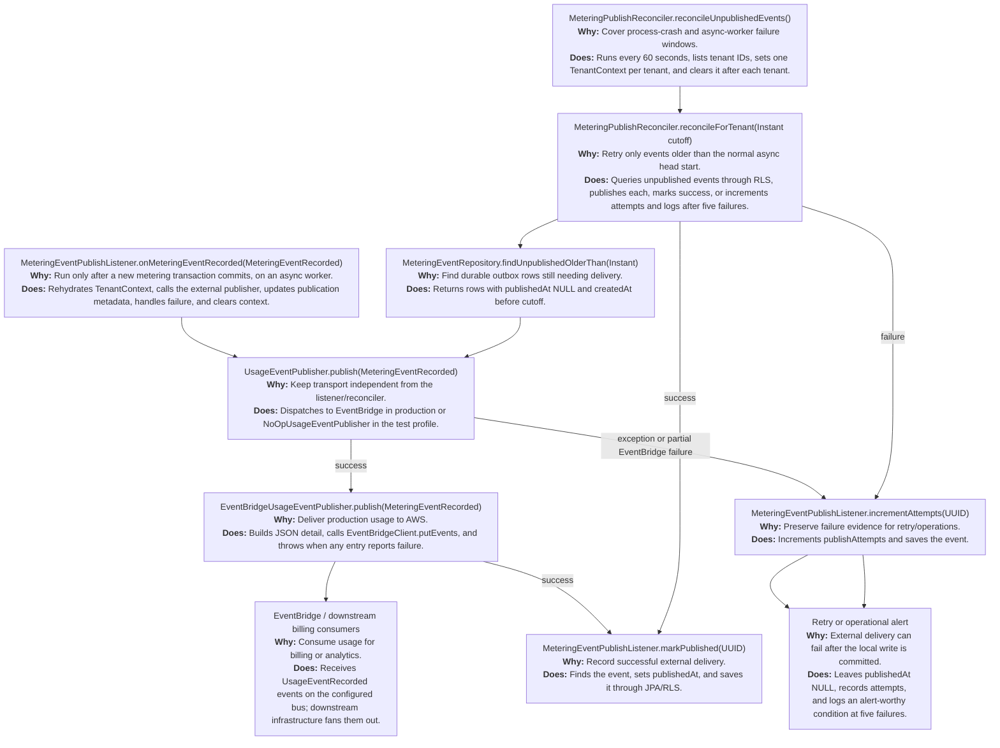
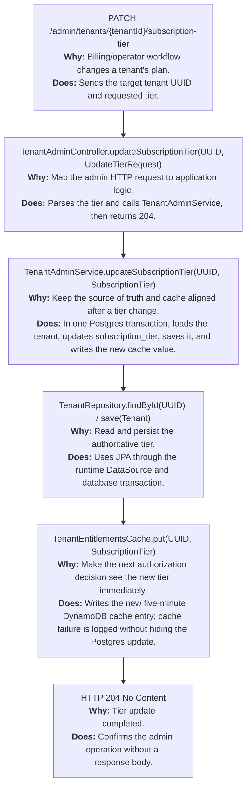

# Entitlements Engine: End-to-End Application Flow

This document traces the application from process startup through the browser or service caller, request filtering, tenant isolation, business logic, persistence, external integrations, and response. Every flow box identifies the owning class and method, why that method is called, and what it does.

## 1. Startup: process to ready application

**Important startup boundary:** `EntitlementsEngineApplication` excludes Spring Boot's automatic Flyway configuration because `FlywayConfig` deliberately runs migrations through a separate privileged connection. Runtime JPA/JDBC uses the restricted `entitlements_app` pool wrapped by `TenantAwareDataSource`.

## 2. Browser or service request: common guardrails

`X-Tenant-Id` is the request-context input used by this repository. The browser decodes JWT claims only for display; the backend is responsible for real token verification. Internal admin and metering endpoints are currently permitted by the HTTP authorization rules and are documented in code as deployment/authentication responsibilities.

## 3. Tenant isolation at the database boundary

## 4. Reports and ABAC flow

The list and single-report read paths do not use `@PreAuthorize`; they still require a tenant header and remain isolated by the database session variable and RLS. The create path requires both tenant tier and user group. Export requires tier only.

## 5. Metering flow: new event, replay, conflict, and response

`MeteringEvent` is the JPA read/update model, while `MeteringEventDao` owns insertion because the atomic `ON CONFLICT ... RETURNING` SQL is the concurrency guarantee. The database unique constraint is the authority when multiple requests arrive together.

## 6. Metering after-commit delivery and recovery

The async listener deliberately restores `TenantContext` because `ThreadLocal` does not cross the `@Async` thread boundary. The scheduled reconciler uses the same per-tenant pattern instead of bypassing RLS.

## 7. Subscription-tier administration

## 8. Complete lifecycle at a glance

```mermaid
flowchart LR
    A["EntitlementsEngineApplication.main(String[] args)<br/><b>Why:</b> Start the JVM application.<br/><b>Does:</b> Enters Spring Boot startup."] --> B["FlywayConfig.flyway -> Flyway.migrate<br/><b>Why:</b> Make the schema ready.<br/><b>Does:</b> Applies versioned tables and RLS policies."]
    B --> C["Spring application context<br/><b>Why:</b> Assemble runtime infrastructure.<br/><b>Does:</b> Creates DataSource, Security, AWS, async, and scheduled beans."]
    C --> D["index.html or platform service<br/><b>Why:</b> Initiate an operation.<br/><b>Does:</b> Sends an HTTP request to the API."]
    D --> E["TenantFilter.doFilterInternal(request, response, filterChain)<br/><b>Why:</b> Establish request tenant state.<br/><b>Does:</b> Sets ThreadLocal or rejects a protected request without a tenant."]
    E --> F["ReportController / MeteringController / TenantAdminController method<br/><b>Why:</b> Handle the mapped endpoint.<br/><b>Does:</b> Validates input and delegates to repository or service logic."]
    F --> G["EntitlementsService.canAccess or MeteringService.recordUsage<br/><b>Why:</b> Apply business policy.<br/><b>Does:</b> Evaluates ABAC or idempotency branches."]
    G --> H["TenantAwareDataSource.getConnection()<br/><b>Why:</b> Bind database work to the request tenant.<br/><b>Does:</b> Sets app.current_tenant on the borrowed connection."]
    H --> I["PostgreSQL RLS, constraints, and tables<br/><b>Why:</b> Enforce durable isolation and consistency.<br/><b>Does:</b> Filters rows, validates writes, and stores state."]
    I --> J["HTTP response<br/><b>Why:</b> Complete the caller interaction.<br/><b>Does:</b> Returns 200/201/204 or 400/403/404/409."]
    G --> K["MeteringEventPublishListener.onMeteringEventRecorded(event)<br/><b>Why:</b> Deliver committed new metering events asynchronously.<br/><b>Does:</b> Publishes externally and records success/failure metadata."]
    K --> L["EventBridgeUsageEventPublisher.publish(event)<br/><b>Why:</b> Send usage to downstream consumers.<br/><b>Does:</b> Calls AWS EventBridge and raises failures for retry."]
    L --> M["MeteringPublishReconciler.reconcileUnpublishedEvents()<br/><b>Why:</b> Recover events missed by the async path.<br/><b>Does:</b> Sweeps old unpublished rows every 60 seconds."]
    M --> I
```

## Source anchors

- Startup and configuration: [EntitlementsEngineApplication.java](../src/main/java/com/platform/entitlements/EntitlementsEngineApplication.java), [FlywayConfig.java](../src/main/java/com/platform/entitlements/config/FlywayConfig.java), [DataSourceConfig.java](../src/main/java/com/platform/entitlements/config/DataSourceConfig.java), [AwsConfig.java](../src/main/java/com/platform/entitlements/config/AwsConfig.java)
- Request and tenant boundary: [SecurityConfig.java](../src/main/java/com/platform/entitlements/security/SecurityConfig.java), [TenantFilter.java](../src/main/java/com/platform/entitlements/tenant/TenantFilter.java), [TenantAwareDataSource.java](../src/main/java/com/platform/entitlements/tenant/TenantAwareDataSource.java), [TenantContext.java](../src/main/java/com/platform/entitlements/tenant/TenantContext.java)
- Reports and ABAC: [ReportController.java](../src/main/java/com/platform/entitlements/domain/ReportController.java), [EntitlementsService.java](../src/main/java/com/platform/entitlements/abac/EntitlementsService.java), [PermissionRule.java](../src/main/java/com/platform/entitlements/abac/PermissionRule.java)
- Metering: [MeteringController.java](../src/main/java/com/platform/entitlements/metering/MeteringController.java), [MeteringService.java](../src/main/java/com/platform/entitlements/metering/MeteringService.java), [MeteringEventDao.java](../src/main/java/com/platform/entitlements/metering/MeteringEventDao.java), [MeteringEventPublishListener.java](../src/main/java/com/platform/entitlements/metering/MeteringEventPublishListener.java), [MeteringPublishReconciler.java](../src/main/java/com/platform/entitlements/metering/MeteringPublishReconciler.java)
- Browser entry points: [index.html](../index.html)
- Database isolation: [V2__enable_row_level_security.sql](../src/main/resources/db/migration/V2__enable_row_level_security.sql), [V4__ensure_metering_events_schema.sql](../src/main/resources/db/migration/V4__ensure_metering_events_schema.sql)